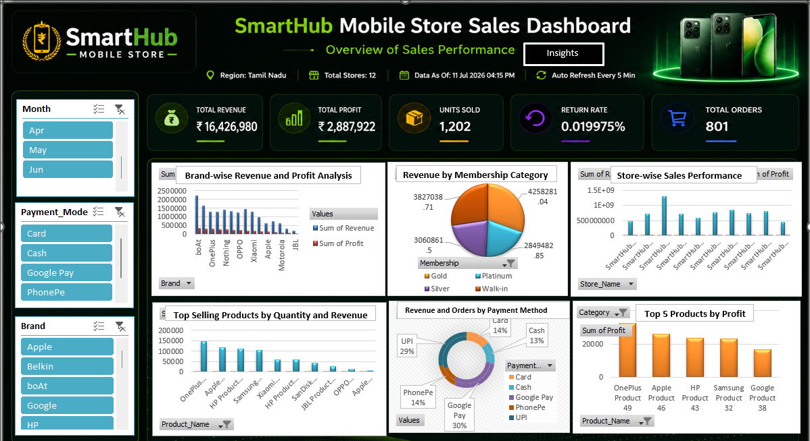

# 📱 SmartHub Mobile Store Sales Analytics Dashboard (Excel)


## 📌 Project Overview

The **SmartHub Mobile Store Sales Analytics Dashboard** is an interactive Microsoft Excel dashboard developed to analyze mobile store sales performance across multiple branches.

The dashboard transforms raw sales data into meaningful business insights using Pivot Tables, Pivot Charts, Slicers, KPI Cards, and interactive visualizations. It enables business users to monitor revenue, profit, customer purchasing behavior, payment preferences, membership contribution, and product performance for informed decision-making.

---

# 📊 Dashboard Preview

<p align="center">
  
</p>

---

# 🎯 Business Objectives

- Analyze overall sales performance
- Monitor revenue and profit by brand
- Evaluate store-wise performance
- Analyze membership contribution
- Identify top-selling products
- Analyze customer payment preferences
- Generate business insights and recommendations

---

# 🛠 Tools & Skills Used

- Microsoft Excel
- Pivot Tables
- Pivot Charts
- Slicers
- KPI Cards
- Conditional Formatting
- Data Cleaning
- Dashboard Design
- Business Analysis

---

# 📁 Dataset Information

| Item | Details |
|-------|----------|
| Industry | Retail |
| Domain | Mobile Store |
| Dataset | SmartHub Mobile Sales |
| Rows | 1,200+ |
| File Format | Excel (.xlsx) |

---

# 📈 KPI Metrics

- 💰 Total Revenue
- 📈 Total Profit
- 📦 Units Sold
- 🔄 Return Rate
- 🛒 Total Orders

---

# 📊 Dashboard Features

### Revenue Analysis
- Brand-wise Revenue & Profit

### Membership Analysis
- Revenue by Membership Category

### Store Performance
- Store-wise Sales Analysis

### Product Analysis
- Top Selling Products
- Top Products by Profit

### Customer Analysis
- Revenue by Payment Method

### Interactive Filters
- Month
- Brand
- Payment Mode

---

# 💼 Business Insights

<p align="center">
  
</p>

### Key Takeaways

- Premium smartphone brands contribute the highest revenue and profit.
- Membership programs significantly improve overall sales.
- Store performance varies across locations.
- A small number of products generate most of the revenue.
- Digital payment methods are preferred by customers.

### Recommendations

- Increase inventory for top-selling products.
- Strengthen loyalty membership programs.
- Replicate strategies from high-performing stores.
- Continue promoting digital payment offers.
- Improve visibility of lower-performing brands through promotions.

---

# 📊 Dashboard Highlights

✔ Interactive Slicers

✔ Dynamic Pivot Charts

✔ Professional KPI Cards

✔ Business Insights Section

✔ Clean Dark Theme Dashboard

✔ Executive-Level Reporting

---

# 📂 Project Structure

```
SmartHub-Mobile-Store-Sales-Analytics
│
├── Data
│   └── SmartHub_Master_Data_Merged.xlsx
│
├── Dashboard
│   └── SmartHub Dashboard.xlsx
│
├── Screenshots
│   ├── dashboard.png
│   └── business_insights.png
│
└── README.md
```

---

# 🚀 Business Value

This dashboard helps management to:

- Track business performance in real time
- Identify top-performing brands and products
- Monitor store performance
- Understand customer payment behavior
- Improve inventory planning
- Support data-driven decision making

---

# 👨‍💻 Author

**Gnana Jothi**

Data Analyst | Excel | SQL | Power BI | Python

GitHub: https://github.com/yourusername

LinkedIn: https://linkedin.com/in/yourprofile

---

⭐ If you found this project helpful, consider giving it a Star!