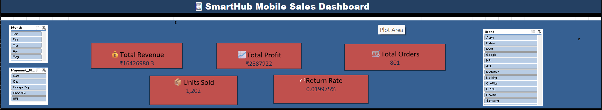

# 📱 SmartHub Mobile Store Sales Analytics

A professional **Business Analytics Dashboard** built in **Microsoft Excel** to analyze mobile store sales performance, profitability, customer purchasing behavior, payment preferences, inventory, and store performance.

---

# 📌 Project Information

- **Project Name:** SmartHub Mobile Store Sales Analytics
- **Client:** SmartHub Mobiles Pvt. Ltd.
- **Department:** Sales & Operations
- **Role:** Business Analyst
- **Tool Used:** Microsoft Excel
- **Dashboard Type:** Interactive Executive Dashboard

---

# 📖 Business Background

SmartHub Mobiles Pvt. Ltd. operates multiple mobile retail stores across Tamil Nadu, selling smartphones, accessories, tablets, and smart devices from leading brands.

The Regional Sales Manager requires a business dashboard to monitor sales performance, profitability, store performance, inventory trends, customer purchasing behavior, and promotional effectiveness.

---

# 🎯 Business Objectives

- Analyze store-wise sales performance
- Identify top-performing mobile brands
- Find best-selling smartphone models
- Evaluate profitability
- Analyze payment preferences
- Monitor product returns
- Understand customer segments
- Improve business decision-making

---

# 📂 Repository Structure

```
SmartHub-Mobile-Store-Sales-Analytics/
│
├── data/
│   ├── raw/
│   └── cleaned/
├── analysis/
├── dashboard/
├── presentation/
├── screenshots/
├── README.md
└── requirements.txt
```

---

# 📊 KPI Cards

The dashboard includes the following KPIs:

- 💰 Total Revenue
- 📈 Total Profit
- 🛒 Total Orders
- 📦 Units Sold
- 🔄 Return Rate

## Screenshot


---

# 📈 Dashboard Visualizations

## 1. Revenue & Profit by Brand

Shows the revenue and profit generated by each mobile brand.

## 2. Top Selling Products

Displays the best-selling smartphone models based on quantity and revenue.

### Screenshot


---

## 3. Payment Method Analysis

Displays customer payment preferences across different payment methods.

## 4. Top 5 Products by Profit

Identifies the products generating the highest profit.

### Screenshot


---

## 5. Store-wise Sales Performance

Compares revenue, monthly target, and profit across all stores.

## 6. Revenue by Membership Category

Shows revenue generated by different customer membership segments.

### Screenshot


---

# 🎛 Interactive Filters

The dashboard includes interactive slicers for:

- Month
- Brand
- Payment Mode

These slicers allow users to dynamically filter and analyze dashboard metrics.

### Screenshot



---

# 📌 Business Questions Answered

- Which mobile brands generate the highest revenue and profit?
- Which smartphone models are the best-selling products?
- Which stores consistently achieve their monthly sales targets?
- Which accessories contribute the highest profit margin?
- How do discounts affect overall profitability?
- Which payment methods are preferred by customers?
- Which customer segments generate the highest revenue?
- Which products have the highest return rate?

---

# 💡 Business Insights

- Top-performing mobile brand generated the highest revenue and profit.
- Best-selling smartphone contributed the highest sales.
- Best-performing store achieved the highest sales.
- Accessories generated high profit margins.
- Higher discounts reduced profitability.
- Google Pay was the most preferred payment method.
- Premium customers generated the highest revenue.
- Product return rate remained around **2%**, indicating good product quality.

---

# 🛠 Excel Features Used

- Pivot Tables
- Pivot Charts
- KPI Cards
- Slicers
- XLOOKUP
- IF Functions
- SUM
- COUNTIF
- Conditional Formatting
- Data Validation
- Excel Dashboard Design

---

# 📈 Dashboard Features

- Executive KPI Cards
- Interactive Slicers
- Dynamic Pivot Charts
- Professional Layout
- Business Insights
- Executive-Level Reporting

---

# 🚀 Outcome

The dashboard enables management to:

- Monitor overall sales performance
- Track profitability
- Compare store performance
- Identify top-performing brands and products
- Understand customer payment preferences
- Improve inventory planning
- Support data-driven business decisions

---

# 👨‍💻 Author

**Gnanajothi M**

Business Analyst | Data Analyst Fresher

GitHub: https://github.com/GnanajothiM

LinkedIn: *(Add your LinkedIn profile link here)*

